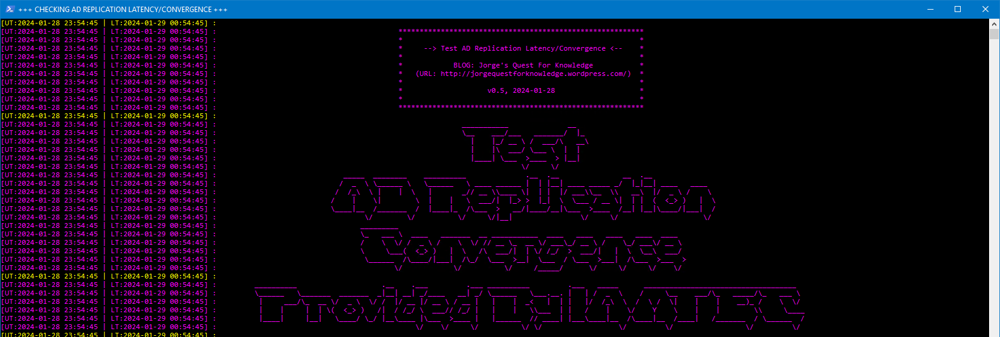
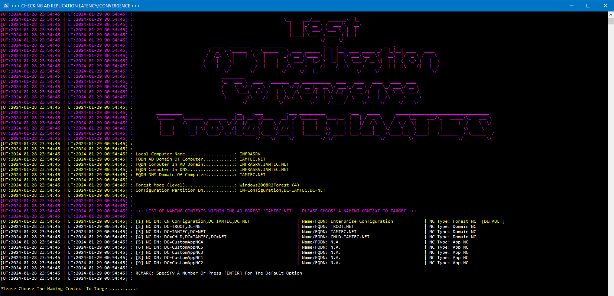
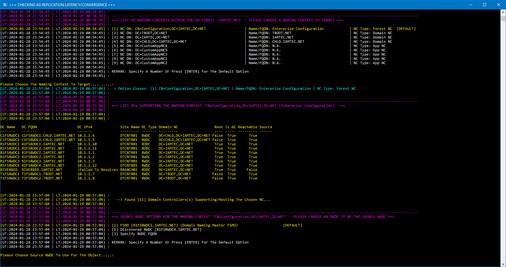
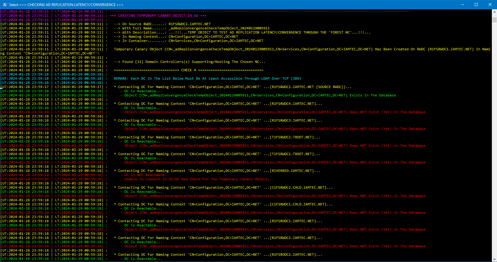
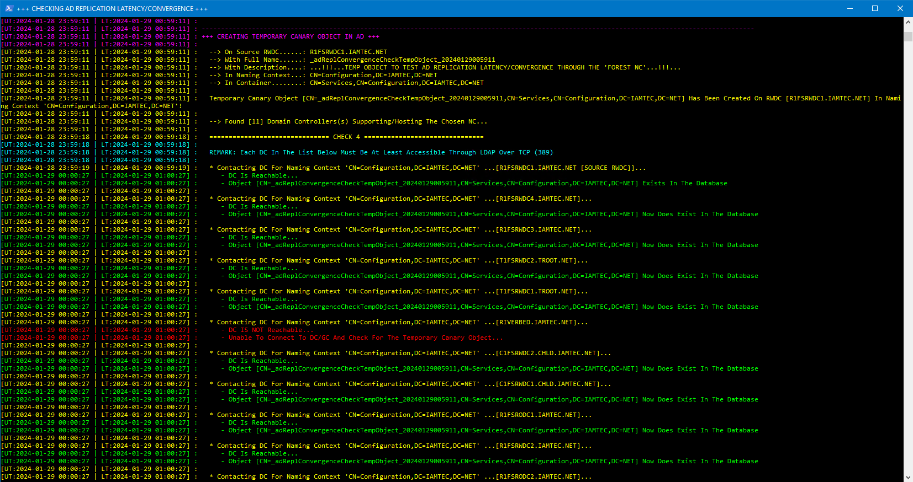
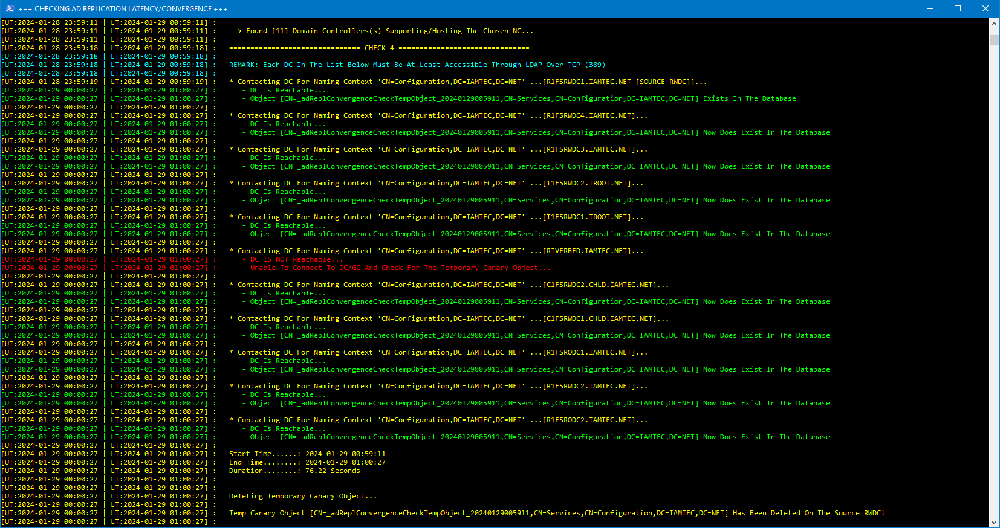
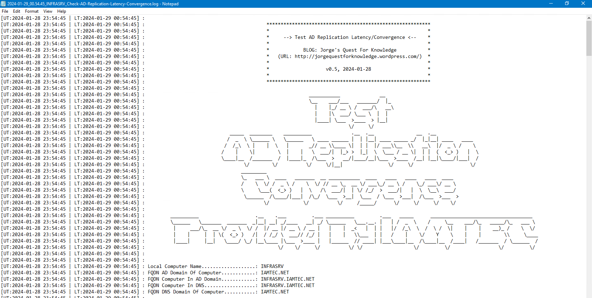
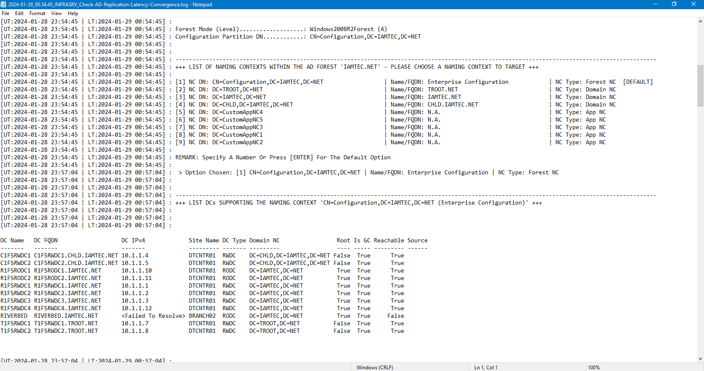
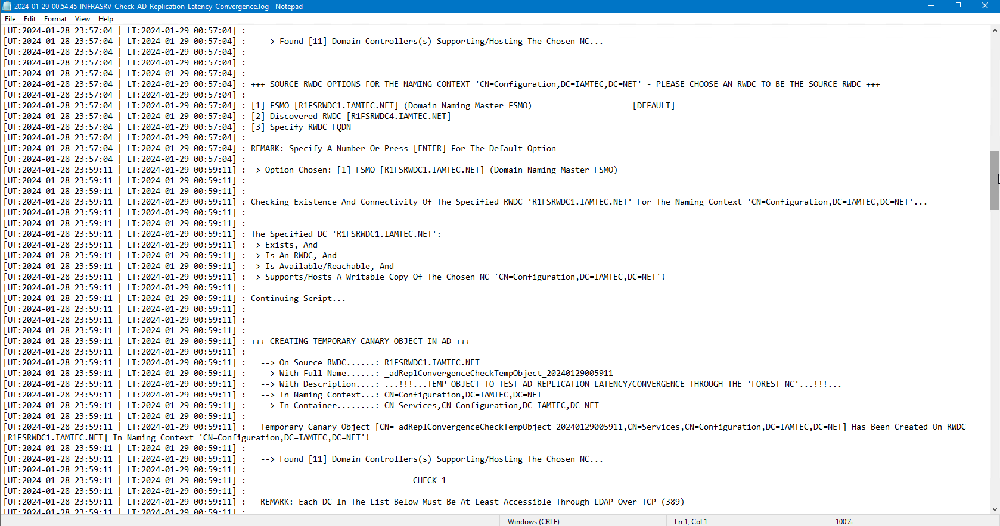
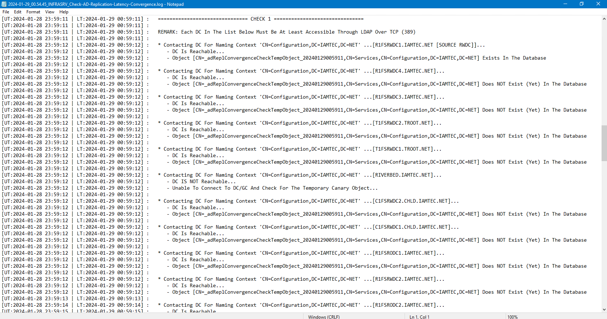

# SCRIPT: Check-AD-Replication-Latency-Convergence

## AUTHOR/FEEDBACK

* Written By: Jorge de Almeida Pinto [MVP Security / Lead Identity/Security Architect]
* Re-Written By: N.A.
* Company: IAMTEC &gt;&gt; Identity | Security | Recovery [https://www.iamtec.eu/]
* Blog: Jorge's Quest For Knowledge [http://jorgequestforknowledge.wordpress.com/]
* For Feedback/Questions: scripts DOT gallery AT iamtec.eu
  * Please Describe Your Scenario As Best As Possible With As Much Detail As Possible.
  * If Applicable Describe What Does and/Or Does Not Work.
  * If Applicable Describe What Should Be/Work Different And Explain Why/How.
  * Please Add Screendumps.

## ORIGINAL SOURCE(S)

* <https://github.com/zjorz/Public-AD-Scripts/blob/master/Check-AD-Replication-Latency-Convergence.ps1>

## DISCLAIMER

* The script is FREEWARE, you are free to distribute/update it, but always refer to the original source(s) as the location where you got it
* This script is furnished "AS IS". NO warranty is expressed or implied!
* I HAVE NOT tested it in every scenario or environment
* ALWAYS TEST FIRST in lab environment to see if it meets your needs!
* Use this script at YOUR OWN RISK! YOU ARE RESPONSIBLE FOR ANY OUTCOME/RESULT BY USING THIS SCRIPT!
* I DO NOT warrant this script to be fit for any purpose, use or environment!
* I have tried to check everything that needed to be checked, but I DO NOT guarantee the script does not have bugs!
* I DO NOT guarantee the script will not damage or destroy your system(s), environment or anything else due to improper use or bugs!
* I DO NOT accept liability in any way when making mistakes, use the script wrong or in any other way where damage is caused to your environment/systems!
* If you do not accept these terms DO NOT use the script in any way and delete it immediately!

## KNOWN ISSUES/BUGS

* N.A.

## RELEASE NOTES

* v0.5, 2024-01-28, Jorge de Almeida Pinto [MVP Security / Lead Identity/Security Architect]:

  * Script Improvement: Complete rewrite of the script
  * New Feature: Parameters added to support automation
  * New Feature: Logging Function
  * New Feature: Support for all NCs (Configuration Partition As The Forest NC, Domain NCs With Domain Only Or Also Including GCs In Other AD Domains, And App NCs)
  * Code Improvement: As target RWDC use specific role owner, disccovered RWDC, specific RWDC

* v0.4, 2014-02-11, Jorge de Almeida Pinto [MVP Security / Lead Identity/Security Architect]:
  * Code Improvement: Added additional logic to determine if a DC is either an RWDC or RODC when it fails using the first logic and changed the layout a little bit

* v0.3, 2014-02-09, Jorge de Almeida Pinto [MVP Security / Lead Identity/Security Architect]:
  * Bug Fix: Solved a bug with regards to the detection/location of RWDCs and RODCs

* v0.2, 2014-02-01, Jorge de Almeida Pinto [MVP Security / Lead Identity/Security Architect]:

  * New Feature: Added STOP option
  * Added few extra columns to output extra info of DCs,
  * Code Improvement: Better detection of unavailable DCs/GCs
  * Added screen adjustment section

* v0.1, 2013-03-02, Jorge de Almeida Pinto [MVP Security / Lead Identity/Security Architect]:
  * Initial version of the script

## SYNOPSIS/DESCRIPTION

This PoSH Script Checks The AD Replication Latency/Convergence Across Specified NC And Replication Scope

This PoSH script provides the following functions:

* It executes on a per specified NC basis. For multiple NCs use automation with parameters
* For automation, it is possible to define the DN of an naming context, the replication scope (only applicable for domain NCs), and the RWDC to use as the source RWDC to create the temoporary canary object on
* It supports non-interacive mode through automation with parameters, or interactive mode
* It supports AD replication convergence check for any NC within an AD forest.
  * Configuration Partition As The Forest NC to test AD replication convergence/latency across the AD forest
  * Domain NCs with domain only scope to test AD replication convergence/latency across the AD domain
  * Domain NCs with domain and GCs scope to test AD replication convergence/latency across the AD domain and the GCs in other AD domains
  * App NCs to test AD replication convergence/latency across the application partition
* As the source RWDC, it is possible to:
  * Use the FSMO
    * For the Configuration Partition  =&gt; FSMO = RWDC with Domain Naming Master FSMO Role (Partitions (Container) Object, Attribute fSMORoleOwner has NTDS Settings Object DN of RWDC)
    * For the Domain Partition         =&gt; FSMO = RWDC with PDC Emulator FSMO Role (Domain NC Object, Attribute fSMORoleOwner Has NTDS Settings Object DN of RWDC)
    * For the Application Partition    =&gt; FSMO = RWDC with Infrastructure Master FSMO Role (Infrastructure Object, Attribute fSMORoleOwner has NTDS Settings Object DN of RWDC)
  * Use a discovered RWDC (best effort, especially with application partitions)
  * Specified the FQDN of a RWDC that hosts the naming context
* For the temporary canary object:
  * Initially created on the source RWDC and deleted from the source RWDC at the end
  * ObjectClass     = contact
  * Name            = _adReplConvergenceCheckTempObject_yyyyMMddHHmmss (e.g. _adReplConvergenceCheckTempObject_20240102030405)
  * Description     = ...!!!...TEMP OBJECT TO TEST AD REPLICATION LATENCY/CONVERGENCE THROUGH THE '&lt;NC TYPE&gt;'...!!!...
  * Container:
    * For the Configuration Partition  =&gt; Container = "CN=Services,CN=Configuration,DC=&lt;ROOT DOMAIN&gt;,DC=&lt;TLD&gt;"
    * For the Domain Partition         =&gt; Container = "CN=Users,DC=&lt;DOMAIN&gt;,DC=&lt;TLD&gt;"
    * For the Application Partition    =&gt; Container = "&lt;DN Of App Partition, e.g. DC=CustomAppNC OR DC=DomainDnsZones,DC=&lt;DOMAIN&gt;,DC=&lt;TLD&gt;"
  * Distinguished Name
    * For the Configuration Partition  =&gt; DN = "CN=_adReplConvergenceCheckTempObject_yyyyMMddHHmmss,CN=Services,CN=Configuration,DC=&lt;ROOT DOMAIN&gt;,DC=&lt;TLD&gt;"
    * For the Domain Partition         =&gt; DN = "CN=_adReplConvergenceCheckTempObject_yyyyMMddHHmmss,CN=Users,DC=&lt;DOMAIN&gt;,DC=&lt;TLD&gt;"
    * For the Application Partition    =&gt; DN = "CN=_adReplConvergenceCheckTempObject_yyyyMMddHHmmss,&lt;DN Of App Partition, e.g. DC=CustomAppNC OR DC=DomainDnsZones,DC=&lt;DOMAIN&gt;,DC=&lt;TLD&gt;"
* All is displayed on screen using different colors depending on what is occuring. The same thing is also logged to a log file without colors
* It checks if specified NC exists. If not, the script aborts.
* It checks if specified RWDC exists. If not, the script aborts.
* The script DOES NOT allow or support the schema partition to be targeted!

## PARAMETER(S)

targetNCDN

* With this parameter it is possible to specify the DN of a naming Context to target for AD Replication Convergence/Latency check

targetedReplScope

* With this parameter it is possible to specify the replication scope when targeting a domain NC, being "Domain Only" (DomainOnly) or "Domain And GCs" (DomainAndGCs)

targetRWDC

* With this parameter it is possible to specify the RWDC to use to create the temporary cabary object on. Options that are available for this are "Fsmo", "Discover" or the FQDN of an RWDC

## EXAMPLE(S)

Check The AD Replication Convergence/Latency Using Interactive Mode

``` powershell
.\Check-AD-Replication-Latency-Convergence.ps1
```

Check The AD Replication Convergence/Latency Using Automated Mode For The NC "DC=CustomAppNC1" Using The Fsmo Role Owner As The Source RWDC To Create The Temporary Canary Object On

``` powershell
.\Check-AD-Replication-Latency-Convergence.ps1 -targetNCDN "DC=CustomAppNC1" -targetRWDC Fsmo
```

Check The AD Replication Convergence/Latency Using Automated Mode For The NC "CN=Configuration,DC=IAMTEC,DC=NET" Using The Fsmo Role Owner As The Source RWDC To Create The Temporary Canary Object On

``` powershell
.\Check-AD-Replication-Latency-Convergence.ps1 -targetNCDN "CN=Configuration,DC=IAMTEC,DC=NET" -targetRWDC Discover
```

Check The AD Replication Convergence/Latency Using Automated Mode For The NC "DC=IAMTEC,DC=NET" Using A Specific RWDC As The Source RWDC To Create The Temporary Canary Object On, And Only Check Within The Domain Itself

``` powershell
.\Check-AD-Replication-Latency-Convergence.ps1 -targetNCDN "DC=IAMTEC,DC=NET" -targetedReplScope DomainOnly -targetRWDC "R1FSRWDC1.IAMTEC.NET"
```

Check The AD Replication Convergence/Latency Using Automated Mode For The NC "DC=IAMTEC,DC=NET" Using A Specific RWDC As The Source RWDC To Create The Temporary Canary Object On, And Check Within The Domain And GCs

``` powershell
.\Check-AD-Replication-Latency-Convergence.ps1 -targetNCDN "DC=IAMTEC,DC=NET" -targetedReplScope DomainAndGCs -targetRWDC "R1FSRWDC1.IAMTEC.NET"
```

## NOTES

* To execute this script, the account running the script MUST have the permissions to create and delete the object type in the container used of the specified naming context. Being a member of the Enterprise Admins group
  in general allows the usage of the script against any naming context
* The credentials used are the credentials of the logged on account. It is not possible to provided other credentials. Other credentials could maybe be used through RUNAS /NETONLY /USER
* No check is done for the required permissions

## SCREENSHOTS
























